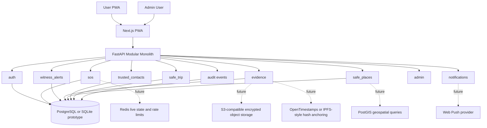
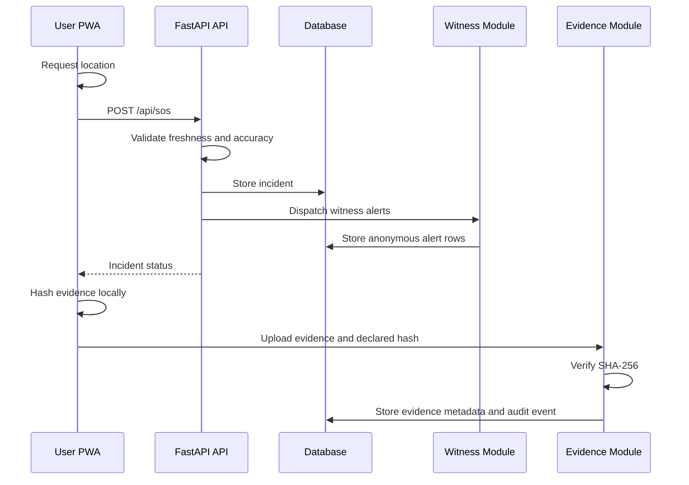
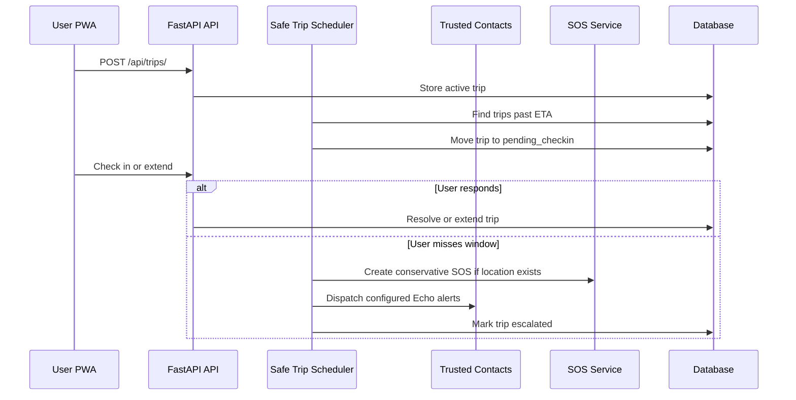

# Abhaya

Abhaya is a hackathon prototype for a PWA-first public safety companion for India. It is built for the general public, with women as the primary safety persona. The product principle is simple: safety with reason.

Abhaya helps a user start an SOS, alert nearby opted-in witnesses, preserve evidence metadata, manage trusted contacts, and run time-bound Safe Trip check-ins. It does not guarantee physical safety, police dispatch, legal admissibility, perfect routing, or notification delivery.

## Problem

Public safety tools often fail in the exact moments they are needed most: weak network, denied permissions, poor GPS, panic, or unavailable contacts. Many products also overclaim what software can guarantee, which is dangerous in a safety-critical context.

Abhaya focuses on a narrower promise:

| Need | Product response |
| --- | --- |
| Start help quickly | SOS flow with location validation and offline queue support |
| Avoid surveillance patterns | Witness opt-in, anonymized alerts, no live responder tracking |
| Preserve useful records | Evidence hash checks, metadata, audit events, and integrity support |
| Handle daily travel anxiety | Safe Trip timer with check-in and trusted-contact escalation |
| Explain failure honestly | Plain-language error messages and visible degraded states |

## Impact

Abhaya is designed to support safer decision-making without pretending to replace emergency services.

| Audience | Impact |
| --- | --- |
| User in distress | Can trigger an SOS, see system state, and keep evidence records attached to an incident |
| Nearby opted-in witness | Can receive an approximate-area alert without exposing their identity by default |
| Trusted contact | Can receive an Echo-style alert when configured escalation starts |
| Admin or demo operator | Can inspect active incidents, audit activity, users, evidence metadata, and safe places |
| Hackathon reviewer | Can see an end-to-end modular monolith with realistic failure handling |

## Solution

The prototype combines a Next.js installable PWA with a FastAPI modular monolith.

Core capabilities implemented in the current codebase:

| Area | Current status |
| --- | --- |
| Authentication | Email/password registration and login with Bearer tokens |
| SOS | Create, resume, resolve, rate-limit, and validate location quality |
| Witness alerts | Opt-in witness alerts with anonymous defaults |
| Evidence | Upload evidence with SHA-256 hash validation and metadata responses |
| Safe places | List, create, verify, and manage public safety locations |
| Trusted contacts | CRUD with masked phone numbers and duplicate/limit validation |
| Safe Trip | Create, extend, check in, cancel, scheduler-based escalation |
| Admin | Metrics, incident detail, users, audit log, safe-place management |
| PWA | Manifest, service worker, install prompt, cached shell routes |
| Tests | Backend integration tests for safety-critical API paths |

Non-goals:

- Guaranteed police dispatch
- Guaranteed physical safety
- Guaranteed legal admissibility of evidence
- Covert recording or surveillance
- Permanent location history
- Guaranteed notification delivery on every browser or network

## Architecture

### High-Level Design



### Runtime Flow: SOS



### Runtime Flow: Safe Trip



## Low-Level Design

### Backend Layout

```text
apps/server/
+-- main.py
+-- app/
    +-- core/
    |   +-- config.py
    |   +-- database.py
    |   +-- security.py
    +-- modules/
    |   +-- admin/
    |   +-- auth/
    |   +-- evidence/
    |   +-- notifications/
    |   +-- safe_places/
    |   +-- safe_trip/
    |   +-- sos/
    |   +-- trusted_contacts/
    |   +-- witness_alerts/
    +-- shared/
        +-- errors.py
        +-- models.py
        +-- utils.py
```

### Frontend Layout

```text
apps/web/src/
+-- app/
|   +-- page.tsx
|   +-- sos/
|   +-- witness/
|   +-- evidence/
|   +-- safe-places/
|   +-- trip/
|   +-- contacts/
|   +-- admin/
+-- components/
|   +-- domain/
|   +-- layout/
|   +-- ui/
+-- lib/
+-- types/
```

### Backend Module Responsibilities

| Module | Responsibility | Key tables |
| --- | --- | --- |
| `auth` | Registration, login, profile, role checks | `users`, `audit_events` |
| `sos` | Incident creation, location validation, active/resolved state | `incidents`, `audit_events` |
| `witness_alerts` | Anonymous opted-in witness alerts | `witness_alerts`, `users`, `incidents` |
| `evidence` | Upload validation, hash verification, evidence metadata | `evidence_items`, `audit_events` |
| `safe_places` | Public safety location CRUD and admin verification | `safe_places`, `audit_events` |
| `trusted_contacts` | Masked contact CRUD, duplicate and limit checks | `trusted_contacts` |
| `safe_trip` | Trip timer, check-in, extension, cancellation, escalation | `trip_monitors`, `incidents` |
| `notifications` | Push subscription stubs for prototype | `users` |
| `admin` | Metrics, incident detail, users, audit, safe-place admin | all relevant tables |

### Data Model Summary

| Table | Sensitive fields | Notes |
| --- | --- | --- |
| `users` | email, password hash, push endpoint | Role is limited to `user` or `admin` |
| `incidents` | exact location, incident history | API responses use approximate coordinates |
| `witness_alerts` | witness id, incident id | Witness identity stays hidden unless revealed |
| `evidence_items` | hashes, metadata, storage filename | Raw storage details are not returned to the UI |
| `safe_places` | public place coordinates | Verification level is visible |
| `trusted_contacts` | phone number | API returns masked phone only |
| `trip_monitors` | destination, location, escalation state | Used by scheduler for Safe Trip transitions |
| `audit_events` | admin actions, actor ids, metadata | Must not expose secrets in details |

## API Reference

Current routes are under `/api`.

| Area | Method | Route | Purpose |
| --- | --- | --- | --- |
| Health | GET | `/api/health` | Service status |
| Auth | POST | `/api/auth/register` | Create account |
| Auth | POST | `/api/auth/login` | Log in |
| Auth | GET | `/api/auth/me` | Current user |
| Auth | PATCH | `/api/auth/me` | Update profile settings |
| SOS | POST | `/api/sos` | Create or return active SOS |
| SOS | GET | `/api/sos/active` | List active incidents for user |
| SOS | GET | `/api/sos/history` | List incident history |
| SOS | GET | `/api/sos/{incident_id}` | Read owned incident |
| SOS | POST | `/api/sos/{incident_id}/resolve` | Resolve owned incident |
| Witness | GET | `/api/witness/alerts` | List witness alerts |
| Witness | POST | `/api/witness/alerts/{alert_id}/acknowledge` | Acknowledge alert |
| Witness | POST | `/api/witness/alerts/{alert_id}/reveal` | Reveal witness identity by choice |
| Evidence | GET | `/api/evidence` | List owned evidence |
| Evidence | POST | `/api/evidence` | Upload evidence with metadata and hash |
| Evidence | DELETE | `/api/evidence/{id}` | Delete evidence |
| Safe places | GET | `/api/safe-places` | List places, optionally nearby |
| Safe places | POST | `/api/safe-places` | Submit a place |
| Safe Trip | POST | `/api/trips/` | Start trip |
| Safe Trip | GET | `/api/trips/` | List trips |
| Safe Trip | GET | `/api/trips/active` | Current active or pending trip |
| Safe Trip | GET | `/api/trips/{trip_id}` | Read owned trip |
| Safe Trip | POST | `/api/trips/{trip_id}/checkin` | Mark safe |
| Safe Trip | POST | `/api/trips/{trip_id}/extend` | Extend ETA |
| Safe Trip | POST | `/api/trips/{trip_id}/cancel` | Cancel trip |
| Contacts | GET | `/api/contacts/` | List trusted contacts |
| Contacts | POST | `/api/contacts/` | Add trusted contact |
| Contacts | PATCH | `/api/contacts/{contact_id}` | Update contact |
| Contacts | DELETE | `/api/contacts/{contact_id}` | Delete contact |
| Admin | GET | `/api/admin/metrics` | System metrics |
| Admin | GET | `/api/admin/incidents` | Incident list |
| Admin | GET | `/api/admin/incidents/{id}` | Incident detail |
| Admin | GET | `/api/admin/audit` | Audit log |
| Admin | GET | `/api/admin/users` | User list |

### Error Format

All expected API errors should use this shape:

```json
{
  "error": {
    "code": "SOS_LOCATION_STALE",
    "message": "Your location is too old. Try again near an open area.",
    "details": {},
    "request_id": "req_123",
    "request-id": "req_123"
  }
}
```

Both `request_id` and `request-id` are returned for compatibility while the API settles.

## Safety And Privacy Rules

| Rule | Current implementation direction |
| --- | --- |
| Do not overclaim safety | UI copy says "helps", "supports", and "can" rather than "guarantees" |
| Keep location temporary | Incidents store location for workflow needs; API returns approximate coordinates |
| Avoid surveillance | Witnesses opt in; sender does not see witness live location |
| Protect contacts | Trusted contact phone numbers are masked in API responses |
| Validate SOS location | Stale and poor-accuracy locations are rejected |
| Rate limit critical flows | Auth, SOS, safe-place submissions, and evidence limits are present |
| Audit sensitive operations | Auth, SOS, evidence, safe-place admin, and admin access use audit events |
| Plain-language errors | Backend returns stable codes with calm user-facing messages |

## Setup

### Prerequisites

| Tool | Version |
| --- | --- |
| Node.js | 20 or newer |
| npm | Bundled with Node |
| Python | 3.11 or newer |
| SQLite | Built into Python for local prototype |

### Install

```powershell
npm install
python -m venv .venv
.venv\Scripts\activate
pip install -r apps/server/requirements.txt
```

### Run Backend

```powershell
npm run dev:server
```

Default API:

```text
http://localhost:8000
```

Health check:

```text
http://localhost:8000/api/health
```

### Run Frontend

```powershell
npm run dev:web
```

Default web app:

```text
http://localhost:3000
```

### Demo Accounts

On first startup the backend seeds demo users if safe places are empty.

| Email | Password | Role |
| --- | --- | --- |
| `demo@abhaya.in` | `demo1234` | user |
| `admin@abhaya.in` | `admin1234` | admin |
| `witness@abhaya.in` | `witness1234` | user, witness opt-in |

## Configuration

Backend settings use the `ABHAYA_` prefix.

| Variable | Default | Purpose |
| --- | --- | --- |
| `ABHAYA_APP_NAME` | `Abhaya Core API` | FastAPI app name |
| `ABHAYA_DEBUG` | `false` | SQL echo and debug behavior |
| `ABHAYA_SECRET_KEY` | development secret | JWT signing key |
| `ABHAYA_ACCESS_TOKEN_EXPIRE_MINUTES` | `1440` | Token lifetime |
| `ABHAYA_DATABASE_URL` | `sqlite+aiosqlite:///./abhaya.db` | Async SQLAlchemy database URL |
| `ABHAYA_EVIDENCE_UPLOAD_DIR` | `./uploads` | Local evidence file directory |
| `ABHAYA_MAX_EVIDENCE_SIZE_BYTES` | `52428800` | Upload size limit |
| `ABHAYA_WITNESS_ALERT_RADIUS_METERS` | `500` | Future geospatial witness radius |
| `ABHAYA_MAX_SOS_PER_HOUR` | `3` | Per-user SOS rate limit |
| `ABHAYA_MAX_SOS_LOCATION_AGE_MINUTES` | `10` | Accepted SOS location age |
| `ABHAYA_MAX_SOS_ACCURACY_METERS` | `5000` | Accepted GPS accuracy radius |
| `ABHAYA_MAX_EVIDENCE_PER_INCIDENT` | `10` | Evidence item cap |
| `ABHAYA_MAX_TRUSTED_CONTACTS_PER_USER` | `5` | Trusted contact cap |
| `ABHAYA_CORS_ORIGINS` | `http://localhost:3000` | Comma-separated or list of allowed origins |

Frontend environment:

| Variable | Default | Purpose |
| --- | --- | --- |
| `NEXT_PUBLIC_API_BASE_URL` | `http://localhost:8000` | API base URL used by the PWA |

## Testing

Backend integration tests use a disposable SQLite database and temporary upload directory.

```powershell
python -m pytest apps\server\tests -q
```

Compile-check backend Python:

```powershell
python -m compileall apps\server
```

Build frontend:

```powershell
npm run build:web
```

Current backend test coverage focuses on:

| Test area | Behavior covered |
| --- | --- |
| Error format | Pydantic validation returns standard Abhaya error shape |
| Trusted contacts | Persistence, masking, duplicate checks, limits, deletion |
| Authorization | Users cannot access another user's contacts or trips |
| SOS | Stale location rejection, poor accuracy rejection, active incident reuse |
| Safe Trip | Create, active lookup, duplicate prevention, extend, check-in, terminal errors |
| Scheduler | Overdue trip moves to pending and escalates with an incident when location exists |
| Evidence | Hash mismatch rejection, media type rejection, successful metadata persistence |

## Deployment

### Recommended Hackathon Deployment

| Layer | Recommendation |
| --- | --- |
| Web | Vercel or Netlify static/Next deployment |
| API | Render, Railway, Fly.io, or similar Python ASGI host |
| Database | PostgreSQL for deployed demo; SQLite only for local |
| Evidence storage | Local disk for prototype; S3-compatible encrypted object store for deployed evidence |
| CORS | Set `ABHAYA_CORS_ORIGINS` to the deployed web origin |
| Secrets | Set `ABHAYA_SECRET_KEY` to a strong random value |

### Backend Deployment Command

```powershell
python -m uvicorn apps.server.main:app --host 0.0.0.0 --port 8000
```

### Frontend Build Command

```powershell
npm run build:web
```

### Deployment Checklist

| Check | Why it matters |
| --- | --- |
| Set a real `ABHAYA_SECRET_KEY` | Prevents token forgery |
| Use PostgreSQL, not SQLite | Handles concurrent demo traffic more reliably |
| Set CORS to exact web origin | Avoids broad browser access |
| Configure persistent uploads or object storage | Prevents evidence files from disappearing on restart |
| Run backend tests before deploy | Catches route, DB, and validation regressions |
| Run frontend build before deploy | Catches TypeScript and route-generation issues |
| Review copy for overclaims | Keeps safety promises honest |

## PWA Notes

The web app includes:

- `public/manifest.json` for installability
- `public/sw.js` service worker
- Cached shell routes for core flows
- Install prompt component
- Offline banner
- SOS offline queue support

Service worker policy:

| Request type | Strategy |
| --- | --- |
| API calls | Network-only |
| Static assets | Cache-first |
| Navigation | Network-first with cached shell fallback |

SOS API calls are never cached.

## Security And Abuse Considerations

| Risk | Mitigation direction |
| --- | --- |
| False SOS spam | Per-user rate limit and audit events |
| Contact data leakage | Mask phone numbers in API responses |
| Witness stalking | Anonymous witness alerts and no live witness location exposure |
| Evidence tampering | Hash verification on upload |
| Admin misuse | Admin routes require role checks and should be audited |
| Weak auth secrets | Environment-configured secret key for deployments |
| Push overclaiming | Notifications are treated as best-effort |

## Future Scope

| Area | Future work |
| --- | --- |
| Database | PostgreSQL migrations with Alembic and PostGIS geospatial queries |
| Realtime | Redis-backed live incident state and rate limits |
| Evidence | Client-side encryption, S3 storage, background retry queue, hash anchoring |
| Notifications | Real Web Push delivery and delivery receipts |
| Safe Trip | Dedicated scheduler worker, SMS provider integration, escalation policy settings |
| Contacts | Optional relationship labels and contact verification |
| Abuse prevention | Report/block flows, trust scores, new-account cooldowns |
| Admin | More granular audit filters and incident timeline exports |
| Accessibility | Formal WCAG AA audit and automated checks |
| Observability | Structured logs, request IDs, metrics, and alerting |
| Deployment | Production-ready Dockerfiles and infrastructure templates |

## Repository Map

```text
.
+-- apps/
|   +-- server/
|   |   +-- main.py
|   |   +-- requirements.txt
|   |   +-- app/
|   |   +-- tests/
|   +-- web/
|       +-- package.json
|       +-- public/
|       +-- src/
+-- scripts/
+-- AGENTS.md
+-- CLAUDE.md
+-- DESIGN_SYSTEM.md
+-- README.md
+-- package.json
```

## Glossary

| Term | Meaning |
| --- | --- |
| SOS | An active emergency incident created by a user |
| Witness | An opted-in user who may receive an approximate-area alert |
| Safe place | A public location that may help during an incident |
| Evidence item | Uploaded media metadata with hash verification |
| Integrity support | Hash-based support for showing a file was not changed after capture |
| Safe Trip | A time-bound journey with check-in and escalation |
| Trusted contact | A user-managed contact who may receive Echo alerts |
| Echo alert | Trusted-contact escalation alert |
| Command center | Admin view for incidents, users, safe places, and audit activity |

## Related Documentation

| File | Purpose |
| --- | --- |
| `AGENTS.md` | Coding agent rules, safety constraints, architecture direction |
| `DESIGN_SYSTEM.md` | UI principles, colors, layout, components, and copy guidance |
| `CLAUDE.md` | Additional contributor guidance |
