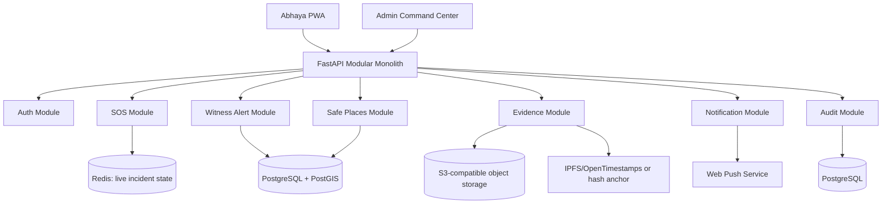
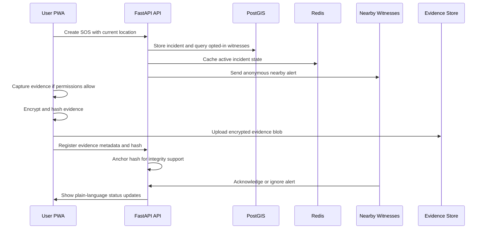

# Abhaya

Abhaya is a hackathon prototype for a PWA-first public safety platform for India. The target audience is the general public, with women as the primary safety persona. The product idea is simple: **safety with reason**. Abhaya should help a person trigger an SOS, alert nearby opted-in users, preserve incident evidence for future FIR support, and present calm, plain-language guidance when the system cannot guarantee something.

This repository is early. The current implementation contains a FastAPI health endpoint and a placeholder Next.js command center page. The architecture below describes the intended prototype direction, not completed production behavior.

## What Exists

- `apps/server`: FastAPI backend with `/api/health`
- `apps/web`: Next.js frontend placeholder dashboard
- Root npm workspace scripts for frontend and backend development
- Documentation for the intended HLD, LLD, engineering standards, and design system

## Planned Prototype Scope

Abhaya should be built as a modular monolith first. Every module should be isolated enough to extract later, but the hackathon version should optimize for speed, clarity, and a believable end-to-end demo.

Planned v1 capabilities:

- Email-based user accounts
- Two roles only: `user` and `admin`
- PWA-first frontend with installable experience
- SOS trigger from the PWA
- Nearby opted-in witness alerts
- Anonymous witness mode until a witness chooses to reveal themself
- Temporary incident location sharing with privacy limits
- Automatic evidence capture where browser capabilities allow it
- Client-side hashing and encryption before evidence upload
- Evidence integrity support for future FIR workflows
- Admin command center for active incidents and audit review
- Maps for incident location and safe-place context
- Push notifications where browser support and permissions allow them
- Plain-language error states for offline, denied permissions, poor GPS, and failed uploads

Non-goals for the prototype:

- Guaranteed police dispatch
- Guaranteed physical safety
- Guaranteed legal admissibility
- Covert surveillance
- Background recording that browsers/PWAs cannot reliably support
- Storing permanent location history

## Repository Layout

```text
.
+-- apps
|   +-- server
|   |   +-- main.py
|   |   +-- requirements.txt
|   +-- web
|       +-- package.json
|       +-- src/app/page.tsx
+-- AGENTS.md
+-- DESIGN_SYSTEM.md
+-- README.md
+-- package.json
```

## Local Setup

Prerequisites:

- Node.js 20+
- npm
- Python 3.11+
- Python virtual environment support

Backend:

```bash
python -m venv .venv
.venv\Scripts\activate
pip install -r apps/server/requirements.txt
npm run dev:server
```

Frontend:

```bash
cd apps/web
npm install
npm run dev
```

Or from the repository root:

```bash
npm install
npm run dev:web
```

Default local URLs:

- Web: `http://localhost:3000`
- API: `http://localhost:8000`
- Health: `http://localhost:8000/api/health`

## High-Level Design

Abhaya should use a modular monolith with clear boundaries:



Recommended runtime split:

- Next.js PWA on Vercel
- FastAPI backend on Render
- PostgreSQL with PostGIS for users, incidents, safe places, audit logs, and geospatial queries
- Redis for active SOS state, short-lived presence, rate limits, and notification fanout
- S3-compatible storage for encrypted evidence blobs

## Core User Flow



## Low-Level Design

### `auth`

Purpose: email-based authentication and role assignment.

Responsibilities:

- Register/login users
- Store password hashes or delegate to a trusted auth provider
- Issue short-lived access tokens
- Enforce `user` and `admin` roles

Key entities:

- `users`: id, email, display_name, role, witness_opt_in, created_at
- `sessions`: id, user_id, expires_at, revoked_at

Expected errors:

- `AUTH_INVALID_CREDENTIALS`: "The email or password is incorrect."
- `AUTH_SESSION_EXPIRED`: "Your session expired. Please sign in again."
- `AUTH_FORBIDDEN`: "You do not have permission to do that."

### `sos`

Purpose: create and manage active incidents.

Responsibilities:

- Create SOS incidents
- Validate location freshness and accuracy
- Store incident lifecycle status
- Avoid exposing exact responder locations to the user
- Queue retryable operations when the network is unstable

Key entities:

- `sos_incidents`: id, user_id, status, latitude, longitude, accuracy_meters, created_at, resolved_at
- `incident_events`: id, incident_id, event_type, payload_json, created_at

Statuses:

- `active`
- `acknowledged`
- `resolved`
- `cancelled`
- `expired`

Expected errors:

- `SOS_LOCATION_REQUIRED`: "We need your location to send nearby alerts."
- `SOS_LOCATION_STALE`: "Your location is too old. Try again near an open area."
- `SOS_RATE_LIMITED`: "Too many SOS attempts. Please wait a moment."
- `SOS_CREATE_FAILED`: "We could not start the SOS. We will keep trying."

### `witness-alerts`

Purpose: notify nearby opted-in users without enabling stalking or surveillance.

Responsibilities:

- Query opted-in users within a default 300 meter radius
- Avoid notifying blocked users or suspicious accounts
- Keep witnesses anonymous unless they reveal themselves
- Rate-limit duplicate alerts

Privacy rules:

- Witnesses see incident area, not unnecessary personal data.
- SOS sender does not see witness live location.
- Witness identity is hidden unless the witness explicitly reveals it.
- Proximity alerts are opt-in.

Expected errors:

- `WITNESS_NONE_AVAILABLE`: "No nearby opted-in users were found yet."
- `WITNESS_ALERT_PARTIAL`: "Some nearby alerts could not be sent."

### `evidence`

Purpose: preserve incident media integrity for future FIR support.

Responsibilities:

- Capture audio/video where PWA permissions allow
- Hash evidence locally with SHA-256
- Encrypt evidence before upload
- Store encrypted blobs in object storage
- Store metadata, hash, and audit trail in PostgreSQL
- Anchor hashes using IPFS/OpenTimestamps when available

Key entities:

- `evidence_items`: id, incident_id, owner_user_id, kind, storage_key, sha256_hash, encryption_metadata, created_at, deleted_at
- `evidence_audit_events`: id, evidence_id, actor_user_id, action, created_at

Retention:

- Keep evidence temporarily by default.
- Allow users and admins to delete evidence.
- Deletion should leave a minimal audit event without retaining sensitive content.

Expected errors:

- `EVIDENCE_PERMISSION_DENIED`: "Recording permission was denied. SOS can still continue."
- `EVIDENCE_UPLOAD_FAILED`: "Evidence upload failed. We saved the incident status and will retry if possible."
- `EVIDENCE_ANCHOR_FAILED`: "Evidence was saved, but integrity anchoring is still pending."

### `safe-places`

Purpose: provide nearby context, not guaranteed safe routing.

Responsibilities:

- Store candidate safe places such as pharmacies, petrol pumps, hospitals, police stations, and open public venues
- Track verification status
- Display confidence and freshness

Verification model:

- `unverified`: imported or user-submitted
- `community-confirmed`: multiple recent confirmations
- `admin-verified`: reviewed by an admin

Expected copy:

- Use "nearby public place" or "verified safe place" only when verification exists.
- Never imply the route or destination is guaranteed safe.

### `notifications`

Purpose: deliver timely but honest alerts.

Responsibilities:

- Web Push subscriptions
- In-app active incident updates
- Retry and failure tracking
- Plain-language delivery state

Expected errors:

- `PUSH_NOT_SUPPORTED`: "This browser does not support push alerts."
- `PUSH_PERMISSION_DENIED`: "Push notifications are off. You can still use Abhaya while the app is open."
- `NOTIFICATION_SEND_FAILED`: "Some alerts could not be delivered."

### `admin-command-center`

Purpose: allow admins to inspect active incidents and system status.

Responsibilities:

- View active incidents
- View evidence metadata and audit history
- Mark safe places as verified
- Resolve or expire incidents
- Avoid showing sensitive data unless necessary

Admin constraints:

- Admin access must be audited.
- Admins must not receive raw evidence unless explicitly needed and allowed.
- Admin actions should be reversible where possible.

## API Conventions

Use resource-oriented paths under `/api`.

Recommended routes:

```text
GET    /api/health
POST   /api/auth/register
POST   /api/auth/login
POST   /api/sos
GET    /api/sos/{incident_id}
POST   /api/sos/{incident_id}/cancel
POST   /api/sos/{incident_id}/resolve
POST   /api/sos/{incident_id}/witness-ack
POST   /api/evidence/upload-url
POST   /api/evidence
GET    /api/admin/incidents
GET    /api/admin/incidents/{incident_id}
POST   /api/admin/safe-places/{safe_place_id}/verify
```

API payload naming should use dash-case for external field names if that remains a project decision. Internally, Python should use snake_case and TypeScript should use camelCase. Use explicit mapping at API boundaries so internal code stays idiomatic.

Standard error shape:

```json
{
  "error": {
    "code": "SOS_LOCATION_REQUIRED",
    "message": "We need your location to send nearby alerts.",
    "details": {},
    "request-id": "req_123"
  }
}
```

## Robustness Rules

Abhaya must be honest under failure.

- Backend offline: show "Abhaya cannot reach the server right now. Keep emergency contacts available and try again."
- Geolocation denied: show "Location is off. Turn it on so nearby alerts can be sent."
- Poor GPS accuracy: show "Your location looks imprecise. Move near a window or open area if you can."
- Weak network: create a local pending SOS and retry when possible.
- Evidence permission denied: continue SOS without recording.
- Evidence upload failed: keep encrypted local metadata where possible and retry.
- Push unsupported: use in-app updates and explain the limitation.

Implementation expectations:

- Validate all inputs on client and server.
- Prefer idempotent incident and evidence operations.
- Use request IDs for logs and user support.
- Return plain-language messages to users.
- Log technical details server-side only.
- Never expose stack traces or storage keys to the frontend.

## Privacy And Abuse Prevention

Abhaya should be designed as an anti-surveillance product.

Required protections:

- Witness opt-in by default off until consent is captured.
- Temporary location storage only.
- Coarse incident area for witnesses unless exact location is necessary.
- No live responder tracking for SOS senders.
- Rate limits on SOS creation, witness acknowledgements, and evidence uploads.
- Abuse scoring for repeated false incidents.
- Cooldowns for newly created accounts before they can receive sensitive proximity data.
- Block/report flows for abusive users.
- Audit logs for all admin access.
- Least-privilege backend services.

Compliance posture:

- Treat DPDP Act India, GDPR-style rights, and SOC2-style audit discipline as design constraints, even if the prototype is not certified.
- Avoid strong legal claims. Say "evidence integrity support for FIR preparation", not "guaranteed admissible evidence".

## Frontend Pages

Recommended v1 pages:

- `/`: calm home/status surface with SOS action
- `/sos/active`: active SOS state, evidence capture, alert delivery status
- `/witness/alert`: nearby alert detail for opted-in witnesses
- `/evidence`: user evidence vault and deletion controls
- `/safe-places`: nearby public places and verification status
- `/admin`: command center overview
- `/admin/incidents/[id]`: incident detail and audit trail
- `/settings`: profile, witness opt-in, permissions, privacy controls

See `DESIGN_SYSTEM.md` for visual language, components, accessibility, and animation guidance.

## Engineering Practices

- Keep the backend as a modular monolith: routers, services, repositories, schemas, and domain events.
- Keep TypeScript strict and avoid untyped API responses.
- Use Server Components by default in Next.js; use Client Components only for interaction, browser APIs, sensors, maps, and realtime state.
- Keep business rules out of React components and FastAPI route handlers.
- Prefer reusable domain components such as `SOSPanel`, `ResponderMap`, `EvidenceVault`, and `IncidentTimeline`.
- Add libraries when they clearly improve speed, reliability, accessibility, maps, encryption, or UI quality.
- Developers may manually test during the hackathon, but high-risk logic should be easy to cover with tests later.

## Roadmap

Milestone 1: Honest prototype base

- Root workspace
- Health-connected frontend
- Product docs
- Design system

Milestone 2: SOS loop

- Email auth
- Create SOS
- Active incident page
- Plain-language error handling
- PostGIS incident storage

Milestone 3: Witness network

- Witness opt-in
- Nearby geospatial query
- Anonymous witness alert
- Acknowledgement events

Milestone 4: Evidence support

- Browser media capture
- Local hashing
- Client-side encryption
- Encrypted upload
- Evidence metadata and audit events

Milestone 5: Command center

- Admin incident list
- Incident timeline
- Safe-place verification
- Audit log surface

## Known Hard Problems

- PWAs cannot guarantee background shake detection or background recording on every device.
- Browser permissions may block camera, microphone, location, or push notifications.
- Evidence integrity support is not the same as guaranteed legal admissibility.
- Nearby witness alerts can become unsafe if privacy boundaries are weak.
- Safe-place data can become stale quickly.
- Abuse prevention is central, not optional.

## Glossary

- SOS: an active emergency incident created by a user.
- Witness: an opted-in nearby user who receives an anonymous alert.
- Safe place: a public location that may be useful during an incident, with a visible verification level.
- Evidence item: encrypted media or metadata attached to an incident.
- Integrity anchor: a hash record used to show evidence was not modified after capture.
- Command center: admin view for active incidents, safe places, and audit trails.

## Related Docs

- `AGENTS.md`: project rules and coding guidance
- `DESIGN_SYSTEM.md`: visual design system and frontend patterns
